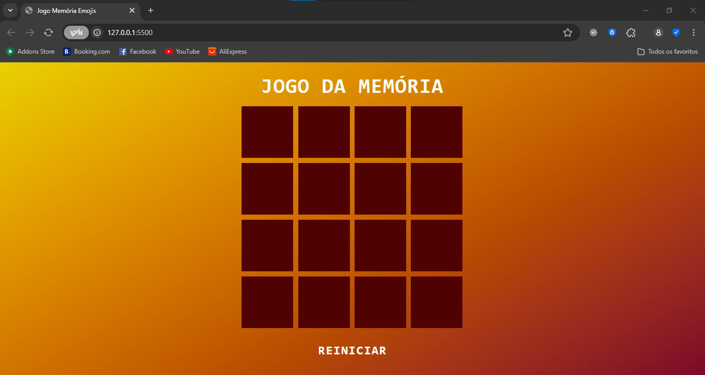
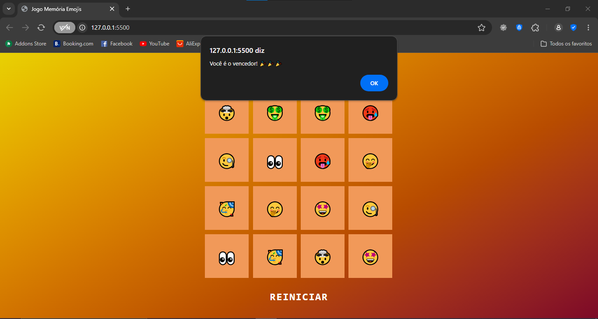
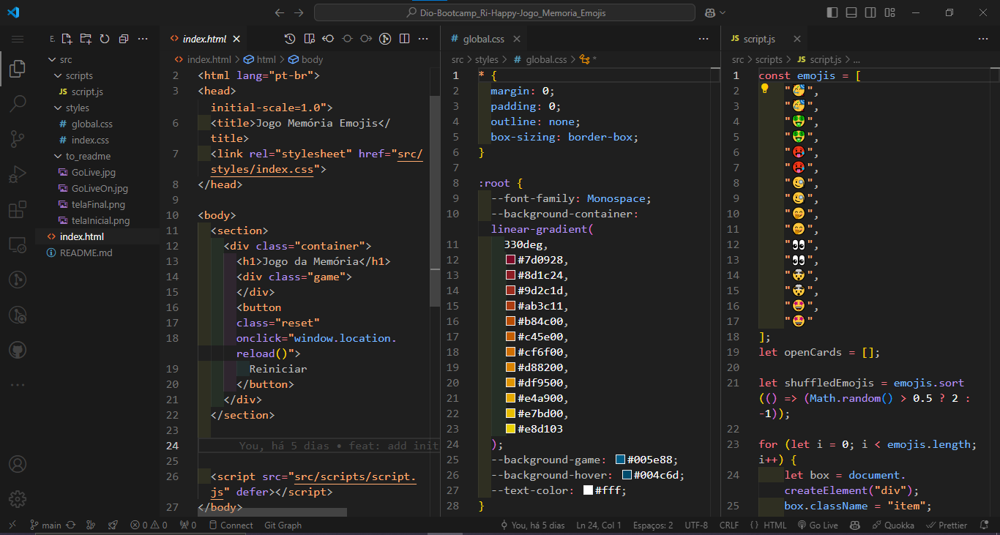
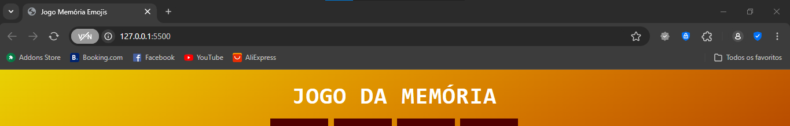

# Dio-Bootcamp_Ri-Happy-Jogo_Memoria_Emojis_JS

Este projeto é uma versão divertida e interativa do clássico Jogo da Memória, onde as cartas são representadas por emojis. Aqui, o foco principal está na lógica de programação em JavaScript, permitindo que a página do jogo seja gerada de forma dinâmica com base em uma lista de emojis.

## Página estática do Jogo de Memoria com Emojis

### 📜 Sobre o Projeto

Desenvolver um jogo da memória onde o jogador precisa encontrar os pares de emojis iguais. O desafio envolve criar um sistema que:

- Gere a área de jogo dinamicamente conforme a lista de emojis.
- Aplique a lógica de comparação entre cartas selecionadas.
- Armazene o estado dos pares encontrados.
- Exiba uma mensagem de vitória personalizada: "Você é o vencedor!!!" ao finalizar o jogo com sucesso.

### 🔗 Links Úteis

- 

- 

### ✅ Status do Projeto

**Em Desenvolvimento**

### 🎥 Deploy

https://ricardo-werner.github.io/Dio-Bootcamp_Ri-Happy-Jogo_Memoria_Emojis_JS/

#### Tela da Página

  

#### Tela da Página com Resultado

  

#### Tela do código

  

### 🧩 Desafio

O desafio proposto neste projeto foi desenvolver uma página do jogo de memória utilizando emojis no lugar das figuras, aplicando a interatividade do usuário com o jogo e o que foi aprendido na utilização do javascript.

### 📝 Requisitos da Aplicação

| Item  | Descrição                                                                       |
|-------|---------------------------------------------------------------------------------|
|  1    | A página deve ser desenvolvida em HTML, CSS e Javascript                        |
|  2    | Modelagem do layout, formatos, tipografias, cores e organização livre.          |
|  2.1  | Opcional: Modelagem de modo livre.                                              |

### 🚀 Plano do Projeto

No desenvolvimento desta página, foram aplicados os seguintes conceitos:

| Item  | Descrição                                   |
|-------|---------------------------------------------|
|  1    | HTML                                        |
|  2    | CSS                                         |
|  3    | Javascript                                  |

### 🛠 Tecnologias Utilizadas

- **Visual Studio Code**
- **HTML**
- **CSS**
- **Javascript**
- **Documentação**
- **ChatGpt**

### 💡 Reflexões

Desenvolver este projeto foi mais um passo no meu desenvolvimento na arte da programação, proporcionando um aprofundamento nas práticas de desenvolvimento web. Com este projeto, dei mais uma passo ao aprendizado no uso do JavaScript para criar interatividade e dinamismo em páginas web, além de reforçar o conhecimento sobre manipulação de dados e lógica de programação.

### 📦 Como Executar o Projeto

1. Clone o repositório:
   
  git clone https://github.com/ricardo-werner/Dio-Bootcamp_Ri-Happy-Jogo_Memoria_Emojis_JS.git

3. Abra o projeto no Visual Studio Code e ative o Go Live:
    
   

     
   

   

     
   

4. Visualize o resultado na página web:

   

     
   

### 🙋‍♂️ Autor
Ricardo Werner 
Dev em Desenvolvimento
